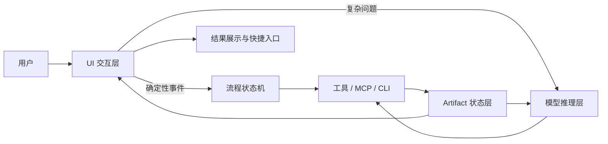

# UI 交互与模型推理分层设计

> **文档状态**：Implemented / 接口层（v7.4.0）；Schema/Router 校验已接入，宿主 UI 仍待实现
>
> **当前边界**：仓库当前不包含独立 UI 应用；本文定义未来 UI 或宿主客户端应遵循的事件、状态和 Artifact 消费方式，不代表按钮、页面或监控已经实现。
> **上游规范**：Artifact 业务字段、持久化与工具失败语义以 `AGENT_TOOLING_REFACTOR_PLAN.md`、`contracts/artifacts/*.schema.json` 和公共研究契约为准。本文只增加 UI 状态和交互约束，不重复发明研究口径。

## 1. 设计目标

将用户交互、模型推理、工具执行和状态传递拆成明确的职责层，减少模型处理确定性任务的次数，降低 API 与 Token 成本，同时让用户通过按钮、状态和快捷入口使用研究系统。

核心分工：

```text
UI        = 状态展示、快捷操作、参数选择、流程控制
模型      = 意图理解、复杂判断、证据解释、自然语言生成
工具      = 数据获取、指标计算、校验、持久化、渲染
Artifact  = 事实、预测、结果和状态的结构化传递
Router    = 阶段识别、顺序编排、异常降级
```

这不是把 UI 与模型完全隔离，而是将确定性工作从模型中移出，把模型资源集中到真正需要推理的任务。

## 2. 总体架构



### 边界原则

- UI 不直接计算金融结论。
- 模型不负责按钮状态、页面导航和固定格式转换。
- 工具不输出不可审计的买卖观点。
- Artifact 是 UI、模型和工具之间的共享状态。
- 重要判断必须由工具证据和模型解释共同形成。

## 3. UI 交互层

### 3.1 适合由 UI 处理的任务

- 盘前、竞价、盘后复盘、近 5 日轮动、个股诊断等确定性导航；
- 展开或折叠报告模块；
- 选择股票代码、分析时点和展示层级；
- 查看来源、历史报告、确认条件和失效条件；
- 重试失败的数据获取；
- 生成报告卡或长图；
- 显示数据更新时间、覆盖率和任务状态。

这些操作不应重复调用模型。

### 3.2 UI 状态

UI 应从 Artifact 读取状态，而不是自行假定任务成功：

```json
{
  "status": "complete",
  "data_status": "ok",
  "coverage": "82%",
  "available_actions": [
    "view_evidence",
    "view_mainlines",
    "update_auction",
    "diagnose_stock",
    "view_calibration"
  ],
  "primary_action": "update_auction"
}
```

推荐状态：

```text
idle
loading
partial
awaiting_input
complete
degraded
failed
```

## 4. 模型推理层

### 4.1 保留给模型的任务

- 处理模糊或多意图问题；
- 判断是否需要跨越多个研究阶段；
- 解释相互冲突的证据；
- 形成主假设和竞争假设；
- 解释板块到个股的逻辑传导；
- 判断催化剂的可信度、持续性和计价程度；
- 组织风险、确认条件和失效条件；
- 根据用户追问调整解释深度。

### 4.2 不应由模型承担的任务

- 手算 ATR、RS、SEI、Brier 或 Opportunity Score；
- 记忆台账路径和 CLI 参数；
- 自己判断页面按钮是否可用；
- 重复读取完整历史报告；
- 将自然语言转换成固定 JSON 后再自行校验；
- 直接假设数据已经更新或持久化成功。

## 5. 事件协议

UI 和模型之间优先传递结构化事件，而不是依赖长句命令：

```json
{
  "event": "diagnose_stock",
  "payload": {
    "symbol": "300308",
    "display_mode": "summary"
  },
  "context": {
    "artifact_ids": ["2026-09-10-daily-v1"],
    "source": "daily_review_watchlist"
  }
}
```

建议事件类型：

```text
start_preopen
update_auction
run_close_review
run_rotation
diagnose_stock
view_evidence
view_calibration
retry_data
render_report
```

### 路由优先级

```text
UI 结构化事件
> 用户明确命令
> 用户提供的股票/板块实体
> 交易日历与时间默认规则
> 模型对模糊意图的推断
```

时间规则不能覆盖用户明确意图。

## 6. 工具执行层

工具负责所有可重复、可验证和高频执行的操作：

```text
获取行情
获取公告
计算指标
验证数据门槛
生成 Artifact
保存和读取状态
评估预测
渲染报告卡
```

优先暴露为 Agent 可直接调用的能力：

```text
get_preopen_context
get_close_review_context
get_rotation_context
get_stock_diagnostic_context
calculate_metrics
save_artifact
load_artifact
evaluate_prediction
render_report
```

工具结果必须带：

```json
{
  "data_status": "ok",
  "source": "...",
  "source_family": "...",
  "independence_group": "...",
  "data_date": "...",
  "as_of": "...",
  "formula_version": "...",
  "payload": {},
  "missing": [],
  "conflicts": []
}
```

## 7. Artifact 状态层

Artifact 用于避免模型重复读取和重复推理。主要类型包括：

```text
Prediction Artifact
Auction Artifact
Close Actual Artifact
Daily Score Artifact
Rotation Artifact
Stock Diagnostic Artifact
Evidence Artifact
```

所有 Artifact 至少包含：

```text
artifact_type
schema_version
snapshot_id
trading_date
as_of
data_status
coverage
source / evidence_ids
model_version（如适用）
formula_version（如适用）
status
```

Artifact 的读取规则：

```text
存在且新鲜 → 校验后复用
不存在     → 独立采集
过期       → 补采或重新生成
冲突       → 并列披露并降低置信度
不可读取   → 继续降级，不阻断当前分析
```

## 8. 成本优化策略

### 8.1 减少无意义模型调用

UI 或工具直接处理：

- 页面导航；
- 状态查询；
- 缓存读取；
- 固定参数校验；
- 报告折叠和展开；
- 重试操作；
- 结构化格式转换。

### 8.2 减少输入 Token

模型默认只接收摘要 Artifact：

```text
市场状态
三态概率
机会分
第一主线
风险提示
下一步动作
```

用户点击“查看证据”后，才加载完整证据链。

### 8.3 避免重复推理

同一份市场或板块 Artifact 可以被多个 Skill 读取，但读取方必须重新检查：

- 时间有效性；
- 数据来源；
- 统计口径；
- 覆盖率；
- 是否适合当前分析任务。

## 9. 失败与降级

| 失败类型 | UI 行为 | 模型行为 | 当前任务是否失败 |
|---|---|---|---|
| 单个数据源失败 | 显示缺失字段 | 继续分析并降低覆盖率 | 否 |
| MCP 不可用 | 显示降级模式 | 使用备用源或输出 N/A | 否 |
| Handoff 不可写 | 显示“仅输出” | 保留报告内 JSON | 否 |
| 台账不可写 | 显示评估未落盘 | 继续输出研究结果 | 否 |
| 行情硬门槛失败 | 显示“暂不评级” | 禁止综合评分 | 是当前评分失败 |
| Artifact Schema 失败 | 显示错误与重试 | 修复后再发布 Artifact | 是该 Artifact 失败 |

## 10. 与当前四个 Skill 的关系

### `market-prediction`

UI 提供“开始盘前”和“更新竞价”；模型解释市场证据；工具计算概率、点位和机会分。

### `daily-review`

UI 提供“开始复盘”和“查看预测偏差”；模型解释主线和产业链；Calibration Engine 独立计算评估指标。

### `sector-rotation`

UI 提供五日窗口、板块和标的入口；模型解释生命周期和资金迁移；工具计算 SEI、轮动矩阵和情绪指标。

### `stock-analysis`

UI 提供代码选择和诊断入口；模型解释八层证据与竞争假设；工具计算 RS、威科夫特征、位置和赔率。

### `stock-research-router`

负责复杂意图和多阶段任务编排，但不负责页面导航细节，也不复制专业分析逻辑。

## 11. 实施顺序

### P0

1. 定义 UI 事件 Schema；
2. 定义 Artifact 的 UI 状态字段；
3. 建立“模型调用前的缓存和状态检查”；
4. 将固定导航和报告展开操作移出模型；
5. 统一失败状态和降级展示。

### P1

1. 增加上下文型 MCP 工具；
2. 增加 `save_artifact`、`load_artifact`、`evaluate_prediction`；
3. 为四个 Skill 编写工具调用配方；
4. 实现摘要视图与证据详情按需加载；
5. 统计模型调用次数和 Token 消耗。

### P2

1. 增加自动化调度和任务进度；
2. 增加可恢复任务和断点续跑；
3. 增加工具耗时、失败率和缓存命中率监控；
4. 将报告卡渲染和分享能力完全移到展示层。

## 12. 验收标准

```text
点击确定性按钮不触发重复模型调用
缓存命中时不重新读取完整历史报告
UI 状态始终来自 Artifact，而非本地猜测
复杂问题仍能交给模型处理
工具计算结果可复现
模型不直接手写复杂 CLI 命令
MCP 或持久化失败时能降级
报告摘要和证据详情可分层加载
用户可清楚看到数据时间、覆盖率和失败原因
API 调用次数和平均 Token 消耗下降
```

## 13. 成功指标

上线后持续跟踪：

- 确定性 UI 操作的模型调用率；
- 平均每次任务模型调用次数；
- 平均输入和输出 Token；
- Artifact 缓存命中率；
- 工具调用成功率；
- 计算结果复现率；
- 用户完成一次研究任务所需操作数；
- 失败任务的可恢复率；
- 跨 Skill 结论一致性。

## 最终原则

```text
UI 负责“怎么操作”
模型负责“怎么理解”
工具负责“怎么执行”
Artifact 负责“怎么记住”
```
